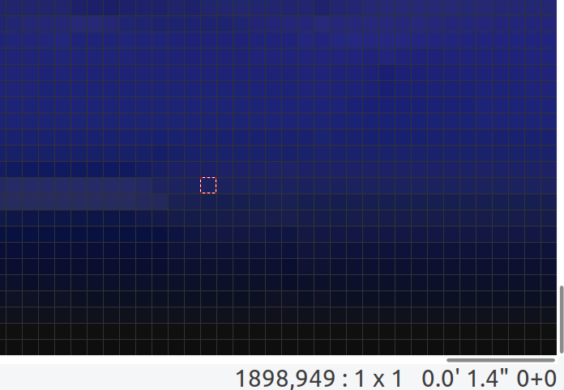
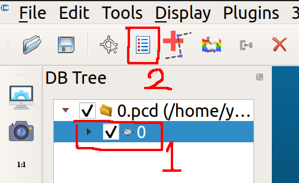
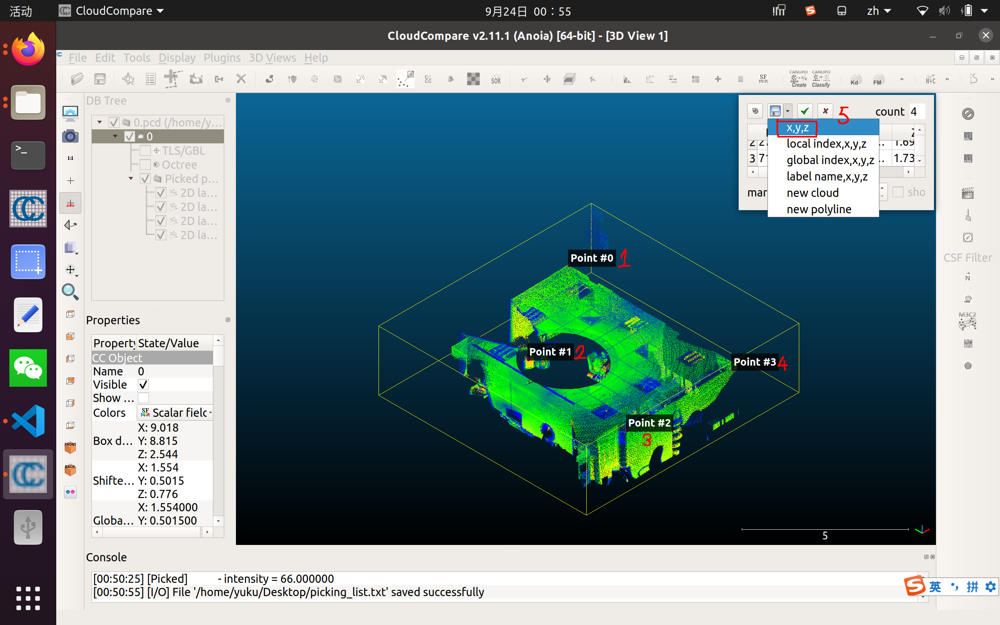
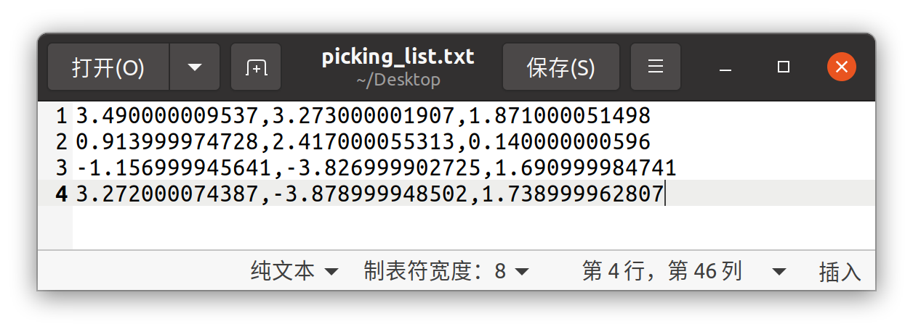
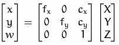
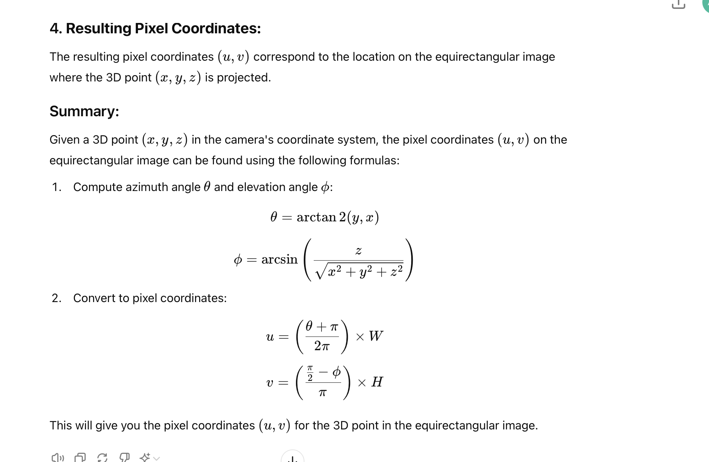
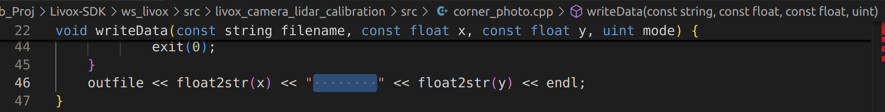
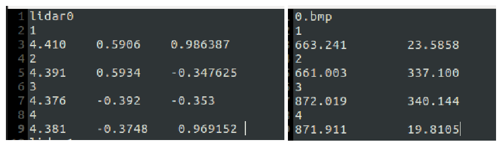
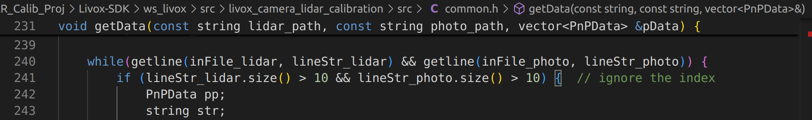

# OMNI_CamLiDAR_Calib_Proj

This project provides a comprehensive set of tools for projecting 3D point cloud data onto 2D image planes, allowing you to visualize the alignment between point clouds and images. The repository includes functionality for both pinhole and omnidirectional cameras.

***

This repository is based on the open-source Livox SDK, Livox ROS driver, and livox_camera_lidar_calibration. Major changes have been made to extend the functionality and added new Python implementations.

### Original Repositories:
- [Livox-SDK](https://github.com/Livox-SDK/Livox-SDK)
- [livox_ros_driver](https://github.com/Livox-SDK/livox_ros_driver)
- [livox_camera_lidar_calibration](https://github.com/Livox-SDK/livox_camera_lidar_calibration.git)

All original files, licensing, and credits remain intact. Significant modifications and improvements were made to the calibration and projection process to support omnidirectional cameras and Python-based projections.


## Key Features

- __Camera Intrinsic Calculation:__ Compute the intrinsic parameters of the _pinhole_ camera. _Omnidirectional_ camera is not considered in this case.

- __LiDAR to Camera Extrinsic Calculation:__ Calculate the extrinsic parameters between the LiDAR and camera.

- __Perspective Projection:__ Supports the projection of 3D LiDAR point cloud data on 2D image planes for _pinhole_ cameras.

- __Equirectangular Projection:__ Supports the projection of 3D LiDAR point cloud data on 2D image planes for _omnidirectional_ cameras.

- __Projection Video Generation:__ Perform batch projection on multiple files, and generate videos from the resulting projection images for easy visualization and analysis.

## Steps to Set Up

### Step1: Environment configuration

#### 1.1 Sensors used in tests

This toolbox uses the sensors below to test the functions of calibration and projection.

- Pinhole Camera: a kind of fisheye camera
- Omnidirectional Camera: [THETAZ1 camera](https://thetaz1.com/en/)
- LiDAR: [Livox MID-360](https://www.livoxtech.com/mid-360)

#### 1.2 Install environment and dependencies

- Ubuntu 20.04
- ROS Noetic
- CMake 3.1 +
- PCL installation
- Eigen installation
- Ceres-solver installation

It is strongly recommended to read the following README.md for more relevant information:

Livox_SDK: [README.md](./Livox-SDK/README.md) / [README_CN.md](./Livox-SDK/README_CN.md)

livox_ros_driver: [README.md](./Livox-SDK/ws_livox/src/README.md) / [README.md](./Livox-SDK/ws_livox/src/README_CN.md)

livox_camera_lidar_calibration: [README.md](./Livox-SDK/ws_livox/src/livox_camera_lidar_calibration/README.md)

#### 1.3 Download source code and compile

```
# install OMNI_CamLiDAR_Calib_Proj
git clone https://github.com/YukiKuma111/OMNI_CamLiDAR_Calib_Proj.git
cd OMNI_CamLiDAR_Calib_Proj

# compile Livox_SDK
cd Livox-SDK/build
cmake .. && make
sudo make install

# compile livox_ros_driver and livox_camera_lidar_calibration
cd ../ws_livox
catkin_make
source devel/setup.bash

# create necessary directories
bash create_dir.bash
```

### Step2: Calibration of pinhole camera intrinsic parameters

For a _pinhole_ camera, the projection method is typically referred to as __perspective projection__. Please follow [Step2: Calibration of camera intrinsic parameters](./Livox-SDK/ws_livox/src/livox_camera_lidar_calibration/README.md#21-preparations) to calculate the camera intrinsic parameters [[Note 1](./README.md#notes)].

```
roslaunch camera_lidar_calibration cameraCalib.launch
```

If you cannot guarantee that the checkerboard on the image can be recognized every time, especially if you use a __fisheye camera__, and thus an error occurs when running `cameraCalib`, it is recommended that you can use `batchCameraCalib` to solve this problem ([Modifications: 2](#2-add) contains more details).

```
roslaunch camera_lidar_calibration batchCameraCalib.launch
```

It is also recommended to use a real-time function package provided by ROS for binocular and monocular camera calibration - _camera_calibration_. You can search it online, such as these [link1](https://blog.csdn.net/qq_20373723/article/details/119374980), [link2](https://blog.csdn.net/yuku_1111/article/details/136888421?spm=1001.2014.3001.5502), [link3](https://blog.csdn.net/zhangqian_shai/article/details/86705754).

Save the obtained intrinsic parameters and distortion correct parameters in the path _`~/OMNI_CamLiDAR_Calib_Proj/Livox-SDK/ws_livox/data/parameters/intrinsic.txt'_

However, the projection models for 360-degree cameras are often equirectangular or spherical projections. Instead of projecting onto a flat plane like in the pinhole model, these cameras project the image onto a sphere or a cylinder, allowing them to capture the full scene around the camera [[Note 2](./README.md#notes)]. Thus, in the next several steps, [omni_intrinsic.txt](Livox-SDK/ws_livox/data/parameters/omni_intrinsic.txt) will be used as a default input.

### Step3: Preparations and data collections

Follow [Step3: Preparations and data collections](./Livox-SDK/ws_livox/src/livox_camera_lidar_calibration/README.md#31-calibration-scene-preparation) and collect the point cloud data of the calibration scene in a relatively _empty and static environment_, with a "customMsg" format rosbag, which is required for the subsequent program.

It is also acceptable to use other topics to record point clouds. Check step [step 4.3](#43-acquire-the-corner-coordinates-in-point-cloud) to get different operations.

### Step4: Calibration data acquisition

#### 4.1 Check your intrinsic.txt

For _pinhole camera_, use the intrinsic parameter obtained in step 2.

For _omnidirectional camera_, use an 3*3 identity matrix for intrinsic parameters, and five 0 for distortion correct parameters.

According to your sensor's type, modified `intrinsic_path` in [cornerPhoto.launch](Livox-SDK/ws_livox/src/livox_camera_lidar_calibration/launch/cornerPhoto.launch)

#### 4.2 Acquire the corner coordinates in photo

Follow [4.2 Acquire the corner coordinates in photo](./Livox-SDK/ws_livox/src/livox_camera_lidar_calibration/README.md#42-acquire-the-corner-coordinates-in-photo) step by step.

```
roslaunch camera_lidar_calibration cornerPhoto.launch
```

If there is no UI interface opened, you can download [mtPaint](https://cn.linux-console.net/?p=16764) to find corners pixels. For instance, this pixel is located at (1898, 949).
<div align=center></div>

The default save path for photo corner result is _`~/OMNI_CamLiDAR_Calib_Proj/Livox-SDK/ws_livox/data/corner_photo.txt`_. 

If you create a `corner_photo.txt` and enter corner pixels manually, please add __8 spaces__ between two digits [[Note 3](#notes)].

#### 4.3 Acquire the corner coordinates in point cloud

Follow [4.3 Acquire the corner coordinates in point cloud](./Livox-SDK/ws_livox/src/livox_camera_lidar_calibration/README.md#43-acquire-the-corner-coordinates-in-point-cloud) step by step, if you record point cloud data by "customMsg". Pay attention to the role of filename. This official function will merge every point cloud into one pcd file, so please make sure your environment is static.

```
roslaunch camera_lidar_calibration pcdTransfer.launch
```

However, if you want decompress every frame and merge the point cloud into your desired scene, you can run the command below ([Modifications: 6](#6-add) contains more details):

```
roslaunch camera_lidar_calibration pcdTransferByTsp.launch
```

Next, you can use PCL visualization program to select point coordinates:

```
pcl_viewer -use_point_picking xx.pcd
```

But you can also use [CloudCompare](https://snapcraft.io/install/cloudcompare/ubuntu) to do this. __Remenber to remove commas, rename, and place it under `~/OMNI_CamLiDAR_Calib_Proj/Livox-SDK/ws_livox/data/corner_lidar.txt`__ [[Note 3. figure left](#notes)].

<div align=center></div>
<div align=center></div>
<div align=center></div>

### Step5: Extrinsic calculation

For _pinhole camera_ extrinsic calculation, please follow [Step5: Extrinsic calculation](./Livox-SDK/ws_livox/src/livox_camera_lidar_calibration/README.md#51-parameter-setting) step by step.

```
roslaunch camera_lidar_calibration getExt1.launch
roslaunch camera_lidar_calibration getExt2.launch
```

For _omnidirectional camera_ extrinsic calculation, please use the same parameter setting, but change the command to:

```
roslaunch camera_lidar_calibration getOmniExt1.launch
```

### Step6: Results verification and related applications

You can use the following command to project point cloud data on _pinhole cancamera_ image.

``` 
roslaunch camera_lidar_calibration projectCloud.launch
```

Or, use the following tools:

```
# for pinhole camera
python pinhole_img_projection.py -img xxx.png -pcd xxx.pcd -para xx/xx/ -s xxx.png

# for omnidirectional camera
python omni_img_projection.py -img xxx.png -pcd xxx.pcd -ex xx/xx.txt -s xxx.png

# for batch pinhole camera projection
python auto_projection.py -img xxx.png -pcd xxx.pcd -para xx/xx/ -s xxx.png

# for creating a video from the batch projection images
bash video_generation.bash
```

## Modifications

The following modifications have been made to the original code. You can also search characters `yuku` for more details.

### 1. Fix
[`CMakeLists.txt`](./Livox-SDK/ws_livox/src/livox_camera_lidar_calibration/CMakeLists.txt)

Error: PCL requires C++14 or above. Referece to [Solution](https://blog.csdn.net/handily_1/article/details/122421305).

### 2. Add
[`batchCameraCalib.cpp`](./Livox-SDK/ws_livox/src/livox_camera_lidar_calibration/src/batchCameraCalib.cpp) and [`batchCameraCalib.launch`](./Livox-SDK/ws_livox/src/livox_camera_lidar_calibration/launch/batchCameraCalib.launch), then modify [`CMakeLists.txt`](./Livox-SDK/ws_livox/src/livox_camera_lidar_calibration/CMakeLists.txt)

The original `cameraCalib` will exit the program when it encounters a situation where the chessboard cannot be detected, while this `batchCameraCalib` can skip these invalid image data and continue to retrieve and calculate subsequent content.

### 3. Fix
[`cam_lid_external1.cpp`](./Livox-SDK/ws_livox/src/livox_camera_lidar_calibration/src/cam_lid_external1.cpp) and [`cam_lid_external2.cpp`](./Livox-SDK/ws_livox/src/livox_camera_lidar_calibration/src/cam_lid_external2.cpp)

Error: ‘LocalParameterization’ is not a member of ‘ceres’. Referece to [Solution](https://blog.csdn.net/2301_78593267/article/details/135310726).

### 4. Modify
[cornerPhoto.launch](Livox-SDK/ws_livox/src/livox_camera_lidar_calibration/launch/cornerPhoto.launch)
    
Add an intrinsic file directory of param for omnidirectional camera, but commented out.

### 5. Modify

[pcdTransfer.cpp](Livox-SDK/ws_livox/src/livox_camera_lidar_calibration/src/pcdTransfer.cpp), [projectCloud.cpp](Livox-SDK/ws_livox/src/livox_camera_lidar_calibration/src/projectCloud.cpp), and [color_lidar_display.cpp](Livox-SDK/ws_livox/src/livox_camera_lidar_calibration/src/color_lidar_display.cpp) (without test)

For __Livox MID-360__, it uses "livox_ros_driver2/CustomMsg" as the message title, instead of "livox_ros_driver/CustomMsg".

### 6. Add

[pcdTransferByTsp.cpp](Livox-SDK/ws_livox/src/livox_camera_lidar_calibration/src/pcdTransferByTsp.cpp), [pcdTransferByTsp.launch](Livox-SDK/ws_livox/src/livox_camera_lidar_calibration/launch/pcdTransferByTsp.launch), then modify [`CMakeLists.txt`](./Livox-SDK/ws_livox/src/livox_camera_lidar_calibration/CMakeLists.txt)

The original pcdTransfer will merge every point into one pcd file. Whereas, this pcdTransferByTsp will save each point cloud frame according to the timestamp.

### 7. Add

[omni_cam_lid_external1.cpp](Livox-SDK/ws_livox/src/livox_camera_lidar_calibration/src/omni_cam_lid_external1.cpp), [result_verify.h](Livox-SDK/ws_livox/src/livox_camera_lidar_calibration/src/result_verify.h), [common.h](Livox-SDK/ws_livox/src/livox_camera_lidar_calibration/src/common.h), [getOmniExt1.launch](Livox-SDK/ws_livox/src/livox_camera_lidar_calibration/launch/getOmniExt1.launch), then modify [`CMakeLists.txt`](./Livox-SDK/ws_livox/src/livox_camera_lidar_calibration/CMakeLists.txt)

Change the methods of extrinsic parameters and errors,referring to formulas given in [Note 2](#notes).

### 8. Add

[omni_projection](omni_projection)

To projection point cloud data on both _omnidirectional camera_ or _pinhole camera_.

## Notes
1. The format of the intrinsic matrix for pinhole camera is shown in the following figure.
    <div align=center></div>

</br>

2. An omnidirectional camera does have an intrinsic matrix, while for a 360-degree camera projection, an intrinsic matrix seems unnecessary. The projection process follows from this theory.
    <div align=center></div>

</br>

3. There are __8 spaces__ between two digits when generating 'corner_photo.txt', according to [corner_photo.cpp](Livox-SDK/ws_livox/src/livox_camera_lidar_calibration/src/corner_photo.cpp) line 46.
    <div align=center></div>

    Here is a tamplet (the right one).

    <div align=center></div>

    If your entire line has less than 10 characters [[Note 7 from official README.md](./Livox-SDK/ws_livox/src/livox_camera_lidar_calibration/README.md#notes)], extrinsic calculation will go wrong, because of [common.h](Livox-SDK/ws_livox/src/livox_camera_lidar_calibration/src/common.h) line 241.

    <div align=center></div>

## File Directory

```
OMNI_CamLiDAR_Calib_Proj/
├── doc_resource
├── Livox-SDK
│   ├── build
│   ├── CMakeLists.txt
│   ├── doc
│   ├── Doxyfile
│   ├── LICENSE.txt
│   ├── README_CN.md
│   ├── README.md
│   ├── sample
│   ├── sample_cc
│   ├── sdk_core
│   └── ws_livox
│       ├── create_dir.bash
│       ├── data
│       │   └── parameters
│       │       └── omni_intrinsic.txt
│       └── src
│           ├── images
│           ├── LICENSE.txt
│           ├── livox_camera_lidar_calibration
│           │   ├── CMakeLists.txt
│           │   ├── doc_resources
│           │   │   └── README_cn.md
│           │   ├── launch
│           │   │   ├── batchCameraCalib.launch
│           │   │   ├── cameraCalib.launch
│           │   │   ├── colorLidar.launch
│           │   │   ├── config.rviz
│           │   │   ├── cornerPhoto.launch
│           │   │   ├── getExt1.launch
│           │   │   ├── getExt2.launch
│           │   │   ├── getOmniExt1.launch
│           │   │   ├── pcdTransferByTsp.launch
│           │   │   ├── pcdTransfer.launch
│           │   │   └── projectCloud.launch
│           │   ├── LICENSE.txt
│           │   ├── package.xml
│           │   ├── README.md
│           │   └── src
│           │       ├── batchCameraCalib.cpp
│           │       ├── cameraCalib.cpp
│           │       ├── cam_lid_external1.cpp
│           │       ├── cam_lid_external2.cpp
│           │       ├── color_lidar_display.cpp
│           │       ├── common.h
│           │       ├── corner_photo.cpp
│           │       ├── CustomMsg.h
│           │       ├── CustomPoint.h
│           │       ├── omni_cam_lid_external1.cpp
│           │       ├── pcdTransferByTsp.cpp
│           │       ├── pcdTransfer.cpp
│           │       ├── projectCloud.cpp
│           │       └── result_verify.h
│           ├── livox_ros_driver
│           ├── README_CN.md
│           └── README.md
├── omni_projection
│   ├── auto_projection.py
│   ├── omni_img_projection.py
│   ├── pinhole_img_projection.py
│   └── video_generation.bash
└── README.md

71 directories, 337 files

```

## Reference

Perspective projection scripts are generated by ChatGPT based on this CSDN blog:
https://blog.csdn.net/m0_51697446/article/details/138342083